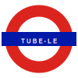

<div align="center">
  

  <h1>Tube-le</h1>

  <p>Guess the mystery London Underground station in six tries.<br>
  A new puzzle every day.</p>


</div>

---

## How to play

Type any station name into the search box and submit your guess. After each wrong answer, a new clue appears above the map — and from clue four, the target station's line or lines switch from grey to colour.

<br>

<div align="center">

| Guess | Clue revealed |
|:-----:|---------------|
| 1 | Year the station opened on the Underground |
| 2 | North or south of the Thames |
| 3 | Zone (1–6) |
| 4 | Lines served — shown in colour on the map |
| 5 | First letter of the station name |
| 6 | Game over |

</div>

<br>

You have six guesses in total. The map starts as a greyscale silhouette of the full network. From guess four, the target line or lines appear in their true colours — the network narrows visually without giving away the name.

After the game ends, the full labelled map is revealed with the station marked.

---

## Stations in play

**164 stations** across nine lines: Bakerloo, Central, Circle, District, Hammersmith & City, Jubilee, Metropolitan, Northern, and Piccadilly.

The Elizabeth line and DLR are not included.

---

## Running locally

```sh
git clone https://github.com/Flacks-Code/Tube-le.git
cd Tube-le
open index.html   # or double-click the file
```

No build step. No dependencies. Everything is in `index.html`.

---

## How the map works

The puzzle uses a Beck-style London Underground map built as a hand-crafted SVG. During the puzzle phase a stripped, label-free version of the map is inlined into the page. On each render:

- **Guesses 1–3** — full network, greyscale.
- **Guess 4+** — greyscale base with the target line(s) overlaid in colour.
- **Game end** — the full 737 KB labelled SVG loads, with the target station circled in red.

Stop distances between stations are calculated with a BFS graph built from each line's station sequences, counting the minimum number of station hops across all lines including the Waterloo & City.

---

## Credits

Base tube map SVG from Networkle.
